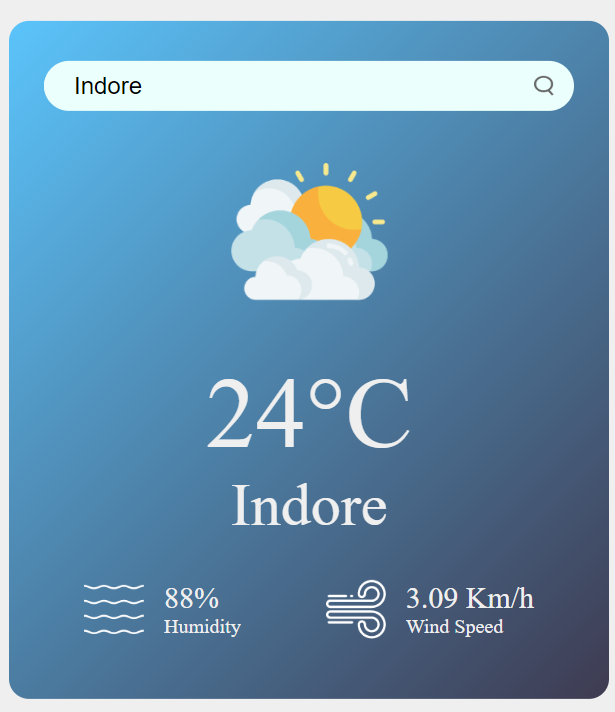

# Weather App

## Description
The Weather App allows users to get real-time weather information for any city. It displays the temperature, humidity, wind speed, and weather condition with corresponding icons.

## Features
- Search for weather information by city name
- Displays temperature, humidity, wind speed, and weather condition
- Shows an error message for invalid city names

## Technologies Used
- HTML
- CSS
- JavaScript
- OpenWeatherMap API

## Installation
1. Clone the repository:
   git clone https://github.com/Shailendrasingh189/PRODIGY_WD_05.git

2. Navigate to the project directory:
    cd PRODIGY_WD_05

## Usage
Open index.html in your preferred web browser.
Enter the name of the city you want to check the weather for in the search box.
Click the search button to display the weather details.

## API
This project uses the OpenWeatherMap API to fetch real-time weather data. You will need an API key to use this service. Replace YOUR_API_KEY in the script with your actual API key.

const apiKey = "YOUR_API_KEY";

## Contributing
Contributions are welcome! Please feel free to submit a Pull Request.

## Acknowledgements
    OpenWeatherMap API
    Font Awesome
Contact
GitHub: github.com/shailendrasingh189
Email: shailendrasinghpanwar189@gmail.com